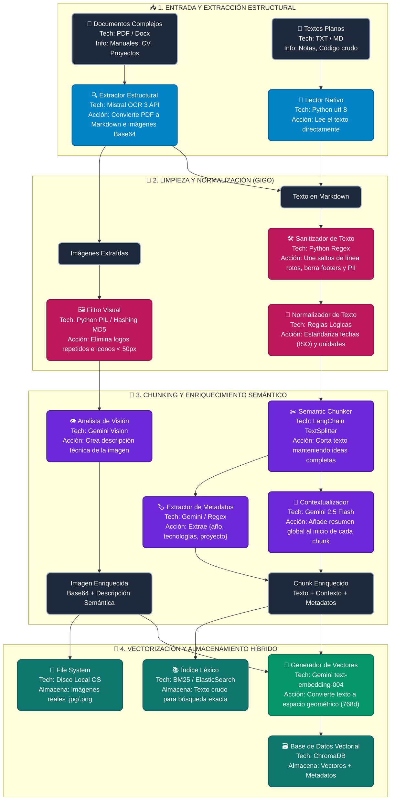
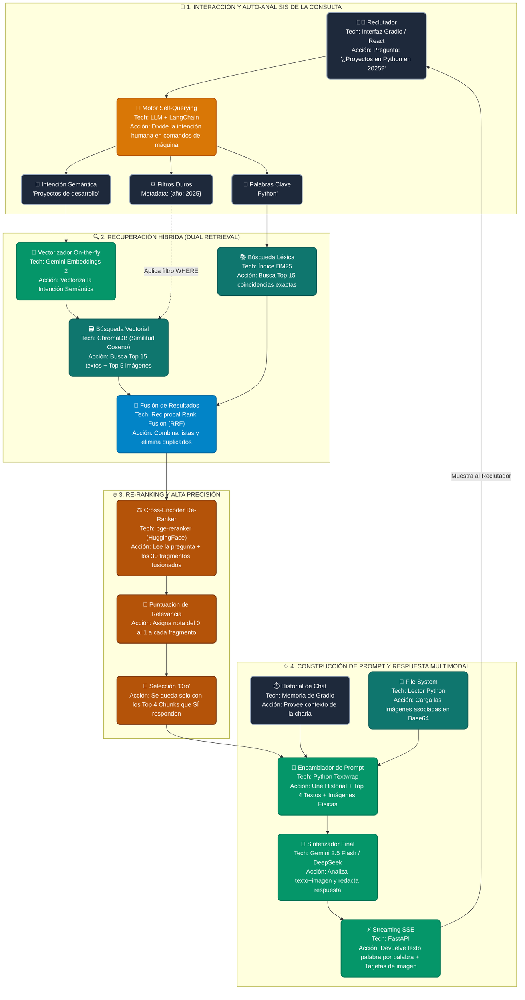

# 🏗️ Arquitectura del Sistema RAG Multimodal (Grado Industrial)

**Proyecto:** Nexa Multimodal RAG  
**Descripción:** Motor de Búsqueda Semántica y Generación Aumentada por Recuperación (RAG) diseñado para procesar y consultar documentos complejos (texto e imágenes) de alta fidelidad.

Este documento detalla los dos macro-flujos que componen el sistema: el **Flujo de Ingesta (Offline)**, encargado de la preparación y enriquecimiento de los datos, y el **Flujo de Consulta (Online)**, que gestiona la recuperación dinámica y síntesis de respuestas.

---

## 📥 1. Macro-Bloque A: Pipeline de Ingesta y Entrenamiento (Offline)

Este flujo se ejecuta de manera asíncrona cuando se añaden nuevos documentos (manuales, currículums, reportes de proyectos) al sistema. Su objetivo es evitar el principio GIGO (*Garbage In, Garbage Out*) mediante limpieza exhaustiva y enriquecimiento semántico antes de la vectorización.

### Diagrama del Flujo de Ingesta



### Explicación de las Fases (Ingesta)
* **Fase 1: Extracción.** Uso de Mistral OCR 3 para transformar documentos no estructurados en Markdown limpio, extrayendo las imágenes sin perder la estructura lógica (tablas, títulos).
* **Fase 2: Limpieza.** Aplicación de expresiones regulares y algoritmos de deduplicación para eliminar basura técnica (encabezados repetitivos, iconos diminutos) que diluye la precisión matemática de los vectores.
* **Fase 3: Enriquecimiento (Contextual Chunking).** La fase crítica. Cada fragmento de texto recibe un resumen global (inyectado por un LLM rápido) para no perder el contexto de qué trata el documento. Se extraen metadatos duros para habilitar filtros SQL-like posteriores.
* **Fase 4: Almacenamiento Dual.** Los datos se guardan tanto en un espacio vectorial (ChromaDB) para búsqueda por significado, como en un índice léxico (BM25) para búsquedas de coincidencias exactas.

---

## 🚀 2. Macro-Bloque B: Flujo de Consulta y Respuesta (Online)

Este flujo ocurre en tiempo real (latencia de milisegundos a segundos) cuando el usuario o reclutador interactúa con el sistema mediante una pregunta en lenguaje natural.

### Diagrama del Flujo de Consulta



### Explicación de las Fases (Consulta)
* **Etapa 1: Self-Querying.** En lugar de buscar directamente lo que escribió el usuario, un LLM actúa como router. Si el usuario pide algo del "2025", el motor lo extrae como un filtro metadata determinista para evitar búsquedas semánticas ineficientes.
* **Etapa 2: Búsqueda Híbrida.** Se atacan dos frentes simultáneos. ChromaDB busca por "significado" y BM25 busca por "coincidencia de texto" para cubrir términos técnicos y acrónimos.
* **Etapa 3: Re-Ranking.** El paso clave para la alta precisión. Un modelo Cross-Encoder evalúa los resultados amplios (top 30) y los puntúa exhaustivamente contra la pregunta original, dejando pasar solo el contexto dorado al prompt final (Top 4).
* **Etapa 4: Generación Multimodal.** Se ensambla el contexto histórico, los chunks de texto dorados y las imágenes físicas relacionadas. El LLM sintetiza la respuesta y la emite hacia el cliente vía Server-Sent Events (Streaming), mostrando texto e interfaz gráfica enriquecida.
```