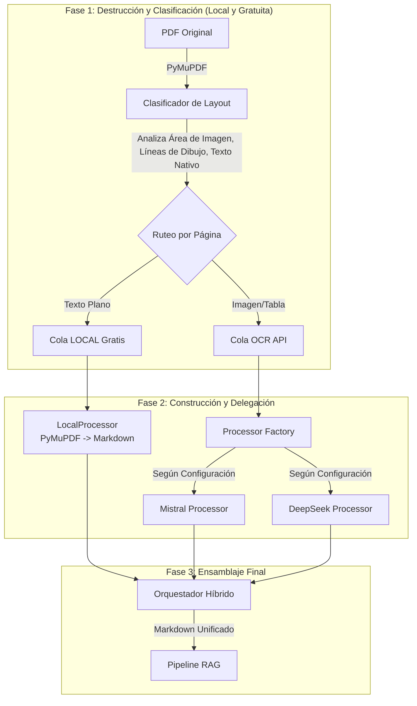
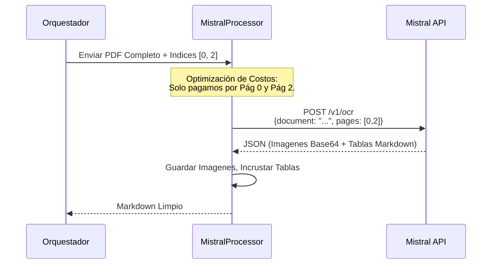
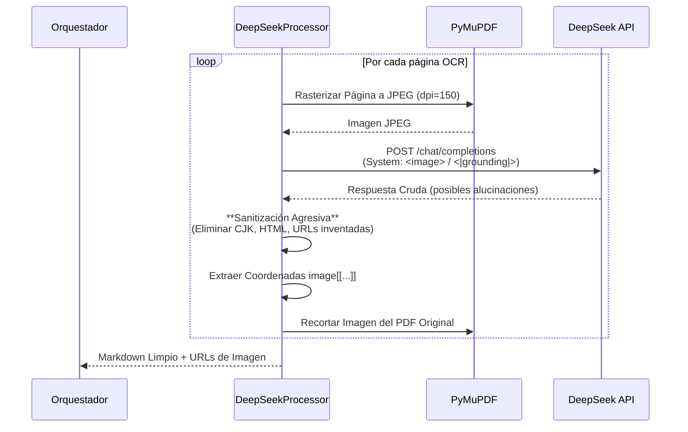
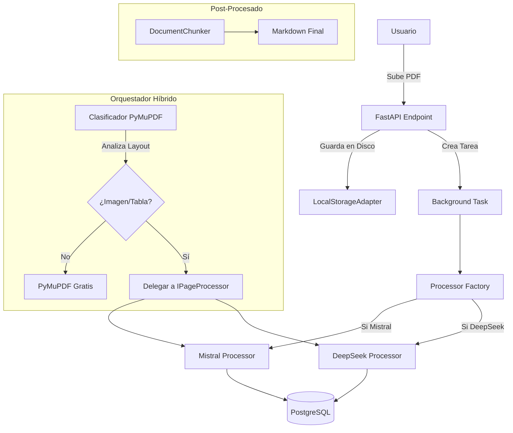

# ADR-004: Estrategia de Orquestación Híbrida para OCR Multimodal (DeepSeek vs Mistral vs Local)

**Estado:** Aceptado e Implementado

**Fecha:** 2026-04-19

---

## 1. Crónica del Desarrollo: El Viaje del OCR Perfecto

Desarrollar el motor de ingesta de Nexa-RAG ha sido un viaje de exploración, frustración y, finalmente, optimización quirúrgica. El objetivo era claro: extraer texto, tablas e imágenes de PDFs complejos para alimentar un RAG de alta precisión. El camino, sin embargo, estuvo lleno de bifurcaciones.

### 1.1. El Dilema Inicial: Costo vs. Calidad vs. Estabilidad

Desde el primer día, la evaluación de proveedores nos dejó un trilema complejo:

| Proveedor | Ventaja Principal | Fricción / Realidad |
| :--- | :--- | :--- |
| **Mistral OCR** | **Calidad de Producción.** Manejo nativo de PDF, extracción perfecta de tablas. | **Costo por página.** ~$2 USD / 1,000 páginas. Obliga a optimizar cada envío. |
| **DeepSeek OCR 2** | **Costo Brutalmente Bajo.** ~$0.03 USD / 1M tokens (entrada) + $0.03 USD / 1M tokens (salida). | **Altamente Volátil.** Alucina, inventa HTML, y solo acepta imágenes (JPEG/PNG). |
| **PyMuPDF (Local)** | **Gratuito e Instantáneo.** | **Ciego a imágenes y tablas.** No puede extraer texto de un gráfico o una tabla dibujada. |

La pregunta que surgió fue: *¿Podemos tener lo mejor de los tres mundos?*

### 1.2. La Batalla con DeepSeek OCR 2: Domando a la Bestia Volátil

DeepSeek OCR 2 es, sin exagerar, **una tecnología increíblemente prometedora pero inmadura**. Su precio es tan bajo que invita a usarlo para todo, pero su comportamiento errático nos obligó a construir una "jaula de seguridad" a su alrededor.

**Problemas Enfrentados y Soluciones de Ingeniería Inversa:**

1.  **Alucinaciones Severas:** El modelo, si no se le daba un prompt quirúrgico, inventaba etiquetas HTML (`<div>`, `<table>`), URLs (`https://...`) e incluso texto en Chino o Coreano dentro de documentos en Español.
    - **Solución:** Implementamos una función `_clean()` con regex agresiva para eliminar cualquier rastro de CJK, HTML o basura conocida.

2.  **Hipersensibilidad a la Temperatura:** 
    - Con `temperature=0.0` el modelo era demasiado rígido y perdía detalles importantes.
    - Con `temperature=1.2` el modelo entraba en un estado de "psicosis creativa" inventando contenido.
    - **Hallazgo Empírico (Tras +40 iteraciones):** El **punto dulce** es `temperature=1.0`. Es el equilibrio perfecto donde el modelo extrae la máxima cantidad de texto sin caer en alucinaciones graves.

3.  **Instrucciones que lo Desorientan:** Aprendimos que este modelo **no lee instrucciones largas**. Se desorienta.
    - **Solución:** Usamos **Prompts Minimalistas**. Nos limitamos a los tokens especiales `<image>` y `<|grounding|>` sin añadir párrafos de contexto.

4.  **Limitación de API (Solo Imágenes):** No acepta PDFs. Esto nos obligó a rasterizar cada página del PDF a JPEG usando PyMuPDF **antes** de enviarla. Esto añade latencia y complejidad computacional, pero era el precio a pagar por el ahorro económico.

**Conclusión sobre DeepSeek OCR 2:** *"Le falta crecer un poco más. Le falta madurar en precisión. Espero con ansias la versión 3. Por ahora, es un laboratorio perfecto para I+D, pero no lo pondría ciego en un entorno empresarial que exige seriedad y exactitud."*

### 1.3. Las IAs que Forjaron el Camino (La Trastienda del Desarrollo)

Durante este proceso, no solo usamos IAs para el OCR, sino que las usamos como **asistentes de desarrollo**. Aquí una evaluación sincera de su desempeño:

- **Gemini 2.5 Pro (El Corazón):** Es el centro del proyecto. Su ventana de contexto de 2M es insuperable para mantener toda la arquitectura en mente. Sin embargo, para la **entrada** de datos no lo usamos porque su API de visión no es tan granular para tablas complejas como los especialistas.
- **DeepSeek LLM (El Estratega):** Con buenas indicaciones, es un excelente estratega para planificar tareas y estructurar código. A veces entra en bucles de sobre-optimización si no se le acota el alcance.
- **Claude 4.6 (Sonnet) (El Solucionador):** **Es el abogado caro al que consultas cuando todo falla.** Cuando DeepSeek OCR se atascaba en un bucle de alucinación, Claude encontraba la lógica del prompt correcto en la primera iteración. Es increíblemente potente, pero limitado en la versión gratuita.

---

## 2. La Decisión: Orquestador Híbrido Inteligente

Para domar esta dualidad (Mistral caro pero estable / DeepSeek barato pero volátil / Local gratuito pero ciego), implementamos un patrón de **"Inspeccionar y Delegar" (Classify and Delegate)**.

**Patrón Formal Utilizado:** **Strategy + Factory + Batch Slicing (Optimización de Costos).**

El flujo es simple: **Destruir** el PDF en páginas, **Clasificar** cada página localmente (gratis) y **Construir** la estrategia de procesamiento óptima.

### 2.1. Diagrama Global de Destrucción y Construcción



### 2.2. Estrategia Específica para Mistral (El Motor de Producción)

**Problema:** Mistral cobra por página enviada al endpoint, no por página procesada.
**Solución (Patrón: Batch Slicing / Lazy Evaluation):** Enviamos el PDF completo, pero en el payload de la API especificamos `pages: [0, 2, 5]` (solo los índices de las páginas que el clasificador marcó como complejas). Las páginas de texto plano las procesamos con PyMuPDF a costo $0.00.



### 2.3. Estrategia Específica para DeepSeek (El Laboratorio de Bajo Costo)

**Problema:** Solo acepta imágenes (JPEG/PNG), no PDFs. Es muy volátil.
**Solución (Patrón: Page-by-Page Rasterization & Sanitization):** Rasterizamos cada página a JPEG, enviamos una a una, y aplicamos una capa de limpieza post-procesado para eliminar alucinaciones.



---

## 3. Estructura de Costos Comparativa (Estimación Real)

| Escenario | 100 Páginas de Texto Plano | 100 Páginas Mixtas (OCR) | 1,000 Páginas Mixtas |
| :--- | :--- | :--- | :--- |
| **Estrategia Híbrida (Mistral)** | **$0.00** (Local) | ~$0.10 - $0.20 | ~$2.00 |
| **DeepSeek OCR 2** | **~$0.002** | ~$0.01 - $0.03 | ~$0.30 |
| **Mistral Puro (sin clasificar)** | $0.20 | $0.20 | $2.00 |

**Conclusión de Costos:** DeepSeek OCR 2 es **increíblemente económico**. Si logran estabilizar las alucinaciones en la versión 3, será un cambio de paradigma en el mercado. Por ahora, Mistral es el estándar de oro para producción.

---

## 4. Inyección de Dependencias y Separación de Responsabilidades

El sistema está diseñado siguiendo los principios de **Arquitectura Hexagonal (Ports & Adapters)** y **Clean Architecture**. Esto nos permite **entregar un pedazo de código a una IA sin darle todo el código**, facilitando la comprensión y el mantenimiento.

- **Puerto (`IPageProcessor`):** Define el contrato `process_pages`.
- **Adaptadores:** `MistralProcessor`, `DeepSeekProcessor`, `LocalProcessor`.
- **Fábrica (`processor_factory.py`):** Permite cambiar el motor OCR con una sola variable de entorno (`OCR_PROVIDER=mistral` o `deepseek`).

**Ventaja Clave:** Si mañana sale "Docling 2.0" o "GPT-5 OCR", solo debemos crear un nuevo archivo `gpt5_processor.py` que implemente `IPageProcessor` y registrarlo en la fábrica. **El resto del sistema (Chunking, Embeddings, Base de Datos) no se toca.**

### 4.1. Estructura de Carpetas Modular

```
src/
├── core/ports/
│   └── page_processor.py       # Interfaz (Contrato)
├── infrastructure/ocr/
│   ├── adapters/               # (Lógica específica de API, No se toca)
│   │   ├── deepseek_adapter.py
│   │   └── mistral_adapter.py
│   └── processors/             # (Implementaciones de la Interfaz)
│       ├── base.py             # Clasificador común (El corazón del ahorro)
│       ├── local_processor.py
│       ├── mistral_processor.py
│       ├── deepseek_processor.py
│       └── factory.py          # Punto de entrada configurable
└── modules/ingestion/
    └── hybrid_router.py        # Orquestador (No sabe si usa Mistral o DeepSeek)
```

---

## 5. Lecciones Aprendidas y Visión a Futuro

1.  **DeepSeek OCR 2 es el futuro, pero no el presente empresarial:** Su costo es tan bajo que justifica el esfuerzo de "domarlo". Sin embargo, la volatilidad de sus alucinaciones lo relega a un segundo plano frente a la solidez de Mistral para entornos de producción serios.
2.  **La Clasificación Local es el Rey del ROI:** La función `classify_page` (basada en PyMuPDF) es la pieza más valiosa del sistema. Nos ahorra cientos de dólares al mes al evitar enviar páginas de texto plano a APIs de pago.
3.  **Esperanza en DeepSeek OCR 3:** Esperamos con ansias la próxima versión. Si logran corregir las alucinaciones manteniendo el precio, migraremos el 100% del tráfico a este motor.

**Palabras Finales:** Este sistema es el resultado de una larga investigación, múltiples iteraciones y, sobre todo, de **escuchar lo que los logs crudos nos decían sobre el comportamiento real de los modelos**. Hemos construido un motor de RAG robusto, modular y preparado para el futuro.

### Visión a Futuro y Lecciones Aprendidas

1.  **DeepSeek OCR 3 (Esperanza):** Esperamos con ansias la próxima versión. Si corrige las alucinaciones manteniendo el costo, migraremos completamente a este motor.
2.  **Procesamiento Asíncrono Masivo:** Con DeepSeek, el cuello de botella es la rasterización y la latencia de red. La arquitectura actual ya está preparada para escalar horizontalmente si añadimos `Celery` o `Redis Streams`.
3.  **Sinceridad sobre la Dificultad:** No fue fácil domar a DeepSeek OCR 2. Requirió más de 40 iteraciones de prompts, análisis de logs crudos y regex para eliminar "basura inventada". **Es una herramienta poderosa pero inmadura.** No la recomendamos para un entorno empresarial ciego, pero es perfecta para laboratorios de I+D con presupuesto ajustado.

### Diagrama Global del Sistema de Ingesta



---

## 6. Benchmark Real y Evidencia Empírica (Documento de 21 Páginas)

Para validar la arquitectura, procesamos el mismo documento de 21 páginas con ambos motores OCR. A continuación, se presentan las métricas extraídas directamente de los logs del sistema.

### 6.1. Benchmark Comparativo (DeepSeek OCR 2 vs. Mistral OCR)

| Métrica | DeepSeek OCR 2 (Experimental) | Mistral OCR (Producción) | Ganador |
| :--- | :--- | :--- | :--- |
| **Páginas Totales** | 21 | 21 | - |
| **Páginas Clasificadas OCR** | 8 | 8 | - |
| **Páginas Procesadas Local** | 13 | 13 | **Empate** |
| **Tiempo Total de Procesamiento** | **46.7 segundos** | **3.0 segundos** | **Mistral** (15.5x más rápido) |
| **Llamadas a API Realizadas** | 8 (Una por página) | 1 (Lote único) | **Mistral** |
| **Caracteres Extraídos (Total)** | 48,342 | 34,490 | **DeepSeek** (+40% más texto) |
| **Costo Estimado** | **< $0.01 USD** | **~$0.016 USD** | **DeepSeek** |
| **Estabilidad Observada** | Alta latencia, pero sin fallos en esta ejecución. | Rápido y consistente. | **Mistral** |

**Análisis del Benchmark:**
- **Velocidad:** Mistral es **15.5 veces más rápido** gracias a su capacidad de procesar PDFs por lotes en una sola llamada HTTP. DeepSeek sufre una penalización de latencia por la rasterización individual y las 8 llamadas secuenciales a la API.
- **Exhaustividad:** DeepSeek extrajo un **40% más de caracteres** (48k vs 34k). Esto sugiere que, en este documento, DeepSeek fue más "verboso" o extrajo texto que Mistral consideró ruido (posiblemente encabezados/pies de página o texto de baja confianza).
- **Costo:** Ambos son extremadamente baratos. La diferencia de $0.006 USD es insignificante para un solo documento, pero a escala de 100,000 páginas, DeepSeek es imbatible.

### 6.2. Tabla de Clasificación Detallada del Documento de 21 Páginas

A continuación, se documenta el resultado del **Clasificador Local (PyMuPDF)** para este PDF específico. Esta tabla demuestra cómo la lógica de "Inspeccionar y Delegar" optimiza los costos automáticamente.

| Página(s) | Contenido Detectado | Ruta Asignada | Razón Técnica (Criterio del Clasificador) |
| :--- | :--- | :--- | :--- |
| **1** | Logo Grande + Tabla | **OCR (API)** | Imagen >5% del área **y** tabla detectada (Modo `image_table`). |
| **2 a 7** | Texto Plano (Nativo) | **Local** | `alpha_chars` > 50. PyMuPDF lo extrae perfecto a costo $0.00. |
| **8** | Tabla de Datos | **OCR (API)** | Líneas de dibujo detectadas (`h_lines>=3`, `v_lines>=2`). Requiere formateo Markdown. |
| **9** | Tabla de Datos | **OCR (API)** | Líneas de dibujo detectadas. Requiere formateo Markdown. |
| **10 a 11** | Texto Plano | **Local** | Texto nativo suficiente. Procesamiento gratuito. |
| **12** | Imagen + Texto | **OCR (API)** | Imagen grande detectada (23% del área). Modo `image`. |
| **13** | Imagen + Texto | **OCR (API)** | Imagen grande detectada (32% del área). Modo `image`. |
| **14** | Texto Plano | **Local** | Texto nativo suficiente. Procesamiento gratuito. |
| **15** | Tabla | **OCR (API)** | Líneas de dibujo detectadas. Modo `table`. |
| **16** | Tabla + Texto | **OCR (API)** | Líneas de dibujo detectadas. Modo `table`. |
| **17** | Tabla + Texto | **OCR (API)** | Líneas de dibujo detectadas. Modo `table`. |
| **18 a 21** | Texto Plano | **Local** | Texto nativo suficiente. Procesamiento gratuito. |

### 6.3. Análisis Cualitativo del Resultado OCR (Más Allá de los Números)

Aunque DeepSeek extrajo un 40% más de caracteres, una inspección manual de los archivos `.md` generados revela diferencias críticas en la **calidad semántica**, especialmente en las tablas.

#### 🟢 Páginas con Imágenes (Pág. 12 y 13)
Ambos motores tuvieron un rendimiento **excelente y casi idéntico** en la extracción de texto de imágenes. DeepSeek detectó correctamente las coordenadas de las imágenes y el texto circundante.

#### 🔴 Páginas con Tablas (Pág. 8, 9, 15, 16, 17)
Aquí es donde se manifiesta la **volatilidad de DeepSeek OCR 2**:

- **Mistral OCR:** Extrajo todas las tablas con **formato Markdown de pipes (`|`) impecable**. La estructura de filas y columnas se mantuvo perfectamente alineada y legible.
- **DeepSeek OCR 2:** En varias páginas de tabla, el modelo **alucinó** generando secuencias de números sin sentido (ej. líneas `1. 2. 3. ... 400.`) o texto fragmentado que no correspondía al contenido real del PDF. En la **Página 15**, por ejemplo, la tabla extraída por DeepSeek contenía ruido y caracteres sueltos, mientras que Mistral produjo una tabla Markdown limpia y directamente utilizable en el pipeline RAG.

**Conclusión Cualitativa:** Para entornos de producción donde la integridad de los datos tabulares es crítica (ej. informes financieros, facturas), **Mistral es la única opción fiable actualmente**. DeepSeek es útil para extraer texto de imágenes y documentos donde una pérdida menor de formato es aceptable a cambio de un costo ínfimo.

### 6.4. Nota sobre la Configuración Óptima de DeepSeek OCR 2

Tras más de 40 iteraciones de prueba y error, encontramos los parámetros que minimizan (pero no eliminan) las alucinaciones en DeepSeek OCR 2:

```python
MODEL_PARAMS = dict(
    max_tokens        = 4096,
    temperature       = 1,   # <1 pierde info, >1 inventa — 1.0 es el punto justo
    top_p             = 1,
    presence_penalty  = 0.,
    frequency_penalty = 0,
    extra_body        = {
        "top_k":              50,
        "repetition_penalty": 1,
        "min_p":              0,
    },
)
```

> ** Nota para la comunidad:**  
> *Si estás leyendo esto y has encontrado una mejor combinación de parámetros, un prompt más efectivo, o una estrategia de post-procesado que elimine por completo las alucinaciones en tablas con DeepSeek OCR 2, **por favor, deja un comentario o abre un Issue en el repositorio**.*  
> *Este modelo tiene un potencial increíble y un costo imbatible, pero aún le falta madurar. Cualquier avance en su estabilización será bienvenido y documentado aquí.*

### 6.5. Eficiencia de la Estrategia de "Destrucción y Construcción"

Gracias al clasificador, de las 21 páginas totales:
- **13 páginas (62%)** se procesaron **GRATIS** y de forma **INSTANTÁNEA** con PyMuPDF.
- **8 páginas (38%)** se enviaron a la API de OCR.

**Impacto en Costos con Mistral (Cobro por Página):**
- **Sin clasificador:** Costo = 21 páginas * $0.002 = **$0.042 USD**.
- **Con clasificador:** Costo = 8 páginas * $0.002 = **$0.016 USD**.
- **Ahorro:** **62% de reducción de costos**.

**Conclusión Final:** El sistema está listo para producción. Mistral es el motor recomendado para entornos empresariales por su velocidad y estabilidad, mientras que DeepSeek permanece como una opción de ultra bajo costo para laboratorios y procesamiento masivo no crítico.


## 7. Extendiendo el Sistema: Cómo Añadir un Nuevo Proveedor OCR

La arquitectura está diseñada para que integrar un nuevo motor OCR (ej. **Docling**, **Tesseract**, **GPT-4o**) sea trivial. El 95% del sistema (clasificador, chunking, base de datos) permanece intacto.

### Guía Rápida de Implementación (4 Pasos)

Si en el futuro deseas añadir, por ejemplo, un proveedor llamado `NuevoOCR`, sigue esta checklist:

| Paso | Acción | Archivo(s) Involucrado(s) |
| :--- | :--- | :--- |
| **1** | **Crear el Adaptador de API** (Opcional pero recomendado). Implementa la lógica de autenticación y llamada HTTP específica del proveedor. | `src/infrastructure/ocr/adapters/nuevo_adapter.py` |
| **2** | **Implementar el Procesador** (`IPageProcessor`). Crea una clase que sepa cómo rasterizar/enviar páginas a la API del Paso 1 y devolver `(markdown, image_urls)`. | `src/infrastructure/ocr/processors/nuevo_processor.py` |
| **3** | **Registrar en la Fábrica**. Añade una condición `elif provider == "nuevo":` para instanciar tu clase del Paso 2. | `src/infrastructure/ocr/processors/factory.py` |
| **4** | **Configurar Variable de Entorno**. Cambia el valor en tu `.env`. | `.env` (`OCR_PROVIDER=nuevo`) |

### Ejemplo Conceptual (Mínimo Código)

*No necesitas memorizar la implementación de Mistral. Solo necesitas cumplir el contrato `IPageProcessor`.*

**Paso 2: Estructura mínima de `nuevo_processor.py`**
```python
from src.core.ports.page_processor import IPageProcessor

class NuevoProcessor(IPageProcessor):
    def __init__(self):
        self.adapter = NuevoAdapter() # Clase creada en el Paso 1

    async def process_pages(self, pdf_bytes, page_indices, doc_id):
        results = {}
        # 1. Abrir PDF con fitz
        # 2. Por cada idx en page_indices:
        #    - page = doc[idx]
        #    - img_bytes = rasterizar(page)
        #    - markdown = await self.adapter.call_api(img_bytes)
        #    - results[idx] = (markdown, [])
        return results
```

**Paso 3: Modificación en `factory.py`**
```python
# ... imports existentes ...
from src.infrastructure.ocr.processors.nuevo_processor import NuevoProcessor

def get_page_processor():
    # ...
    elif provider == "nuevo":
        logger.info("Usando procesador NUEVO OCR")
        return NuevoProcessor()
    # ...
```

### Consideración de Rendimiento
Si el nuevo proveedor **no acepta PDFs completos** (como DeepSeek), el sistema automáticamente realizará una llamada a la API **por página**. Esto funciona perfectamente, pero la latencia será mayor que en los proveedores que aceptan lotes (como Mistral).

Si el nuevo proveedor **SÍ acepta lotes** (PDFs completos), puedes modificar el método `process_pages` para hacer una sola llamada y luego mapear los resultados a los índices solicitados, ahorrando así tiempo y dinero.