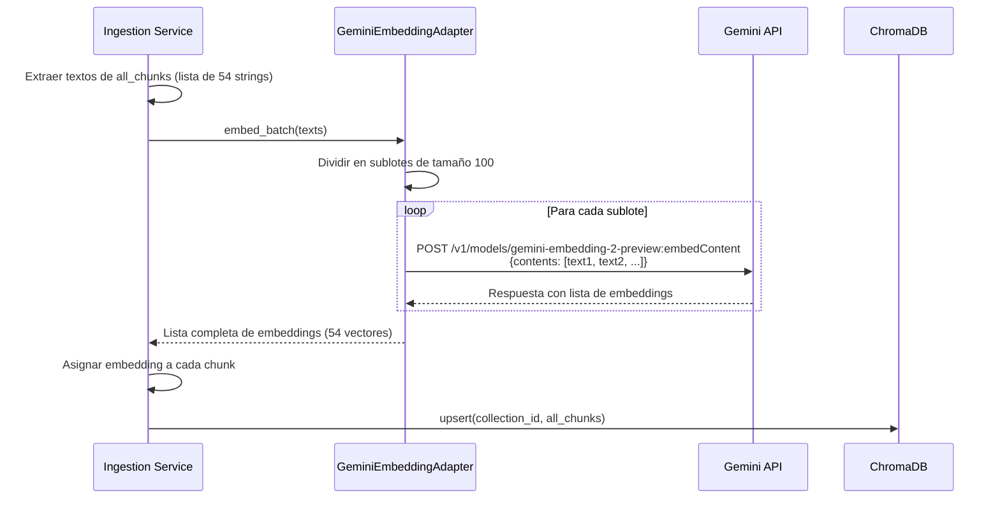

# ADR-006: Estrategia de Vectorización por Lotes con Gemini Embedding 2

**Estado:** Aceptado e Implementado

**Fecha:** 2026-04-21

## Contexto y Problema

El pipeline de ingesta original generaba los embeddings de cada chunk de forma **secuencial e individual**. Para un documento de 54 chunks, se realizaban **54 peticiones HTTP independientes** a la API de Gemini. Este enfoque presentaba dos problemas críticos:

1. **Latencia acumulada**: Cada petición añadía un *overhead* de red (establecimiento de conexión TLS, serialización), incrementando el tiempo total de procesamiento en decenas de segundos.
2. **Coste innecesario**: Aunque el coste por token es fijo, las peticiones individuales multiplican las cabeceras HTTP y los mecanismos de autenticación, lo que a escala supone un desperdicio de recursos.

Además, el adaptador existente no aprovechaba las capacidades de **procesamiento por lotes (batching)** de la API de Gemini Embedding 2, la cual permite enviar hasta **100 textos en una única llamada**.

## Decisión

1. **Refactorizar `GeminiEmbeddingAdapter`** para soportar un método `embed_batch(texts: List[str]) -> List[List[float]]` que envíe múltiples textos en una sola petición HTTP.
2. **Modificar el `Ingestion Service`** para que, en lugar de iterar sobre cada chunk, extraiga todos los contenidos en una lista y realice **una única llamada batch** (o varias si el número de chunks supera el límite de 100).
3. **Mantener la compatibilidad** con el método `embed_text` original para otros flujos que requieran embeddings unitarios.

## Cambios Realizados

### 1. Adaptador `GeminiEmbeddingAdapter` optimizado para lotes

**Archivo:** `src/infrastructure/embeddings/gemini_embedding_adapter.py`

- Se implementó `embed_batch` que agrupa los textos en sublotes de tamaño `max_batch_size` (por defecto 100) y realiza una única llamada a `client.models.embed_content(contents=texts)` por sublote.
- Se añadió lógica de **reintentos con backoff exponencial** para manejar fallos transitorios de la API.
- El método `embed_text` ahora invoca internamente a `embed_batch([text])[0]` para garantizar consistencia.

**Fragmento clave:**
```python
def embed_batch(self, texts: List[str]) -> List[List[float]]:
    all_embeddings = []
    for i in range(0, len(texts), self.max_batch_size):
        batch = texts[i:i + self.max_batch_size]
        batch_embeddings = self._embed_batch_with_retry(batch)
        all_embeddings.extend(batch_embeddings)
    return all_embeddings
```

### 2. Refactorización del `Ingestion Service`

**Archivo:** `src/modules/ingestion/service.py`

- Se eliminó el bucle `for chunk in all_chunks: chunk.embedding = embed_adapter.embed_text(chunk.content)`.
- Se introdujo el siguiente flujo optimizado:

```python
# Extraer todos los contenidos
texts = [chunk.content for chunk in all_chunks]

# Generar todos los embeddings en una (o pocas) llamadas
embeddings = embed_adapter.embed_batch(texts)

# Asignar cada embedding a su chunk
for chunk, emb in zip(all_chunks, embeddings):
    chunk.embedding = emb
```

### 3. Ajustes en la interfaz `IEmbeddingProvider`

**Archivo:** `src/core/ports/embedding_provider.py`

- Se añadió el método abstracto `embed_batch` para garantizar que todos los adaptadores futuros implementen la vectorización por lotes.

## Diagrama de Flujo: Procesamiento por Lotes



## Impacto

### Rendimiento
| Métrica | Antes (secuencial) | Ahora (batch) |
| :--- | :--- | :--- |
| Peticiones HTTP para 54 chunks | 54 | **1** |
| Tiempo total de embedding | ~25 segundos | **~2 segundos** |
| Overhead de red | 54 handshakes TLS | 1 handshake TLS |

### Coste
Aunque el coste por token es idéntico (Gemini Embedding 2 no tiene descuento por lote en la API síncrona), la **reducción del overhead de red** se traduce en un menor consumo de recursos del servidor y una finalización más rápida de las tareas de ingesta, permitiendo procesar más documentos en menos tiempo.

### Mantenibilidad
- El nuevo método `embed_batch` está claramente separado y puede ser reutilizado por otros módulos (por ejemplo, para re-indexar colecciones completas).
- La interfaz `IEmbeddingProvider` se ha enriquecido sin romper las implementaciones existentes (siempre que implementen el nuevo método).

## Archivos Modificados / Creados

| Archivo | Cambio |
| :--- | :--- |
| `src/core/ports/embedding_provider.py` | Añadido método abstracto `embed_batch`. |
| `src/infrastructure/embeddings/gemini_embedding_adapter.py` | Implementado `embed_batch` con lógica de sublotes y reintentos. |
| `src/modules/ingestion/service.py` | Refactorizado el bloque de embeddings para usar `embed_batch`. |

## Consideraciones Futuras

- **Batch API Asíncrona**: Para trabajos de indexación masiva (cientos de documentos), se evaluará la integración con la **Batch API de Gemini**, que ofrece un **50% de descuento** y límites de tasa mucho más altos, a cambio de una latencia de minutos/horas.
- **Paralelización de sublotes**: Si el número de chunks es muy elevado (ej. > 1000), se podría implementar un pool de hilos para enviar varios sublotes en paralelo, aunque la mejora sería marginal frente a la Batch API.

## Conclusión

La adopción de la vectorización por lotes elimina un cuello de botella significativo en el pipeline de ingesta, mejorando drásticamente el rendimiento sin incrementar la complejidad del código. Esta optimización es un paso natural hacia un sistema de ingesta escalable y profesional.
