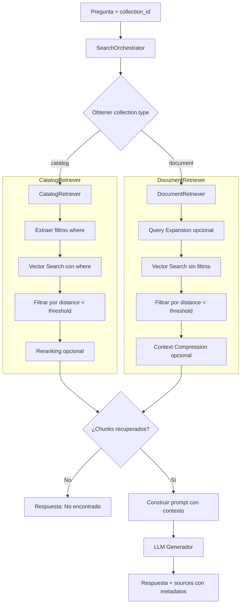

# ADR-007: Sistema de Búsqueda Multimodal con Orquestación por Tipo de Colección

**Estado:** Aceptado e Implementado

**Fecha:** 2026-04-21

## Contexto y Problema

El sistema de búsqueda original (`/v1/query/`) realizaba una búsqueda vectorial simple con parámetros fijos (`top_k=5`), sin distinguir entre tipos de documentos. Esto provocaba dos problemas:

1. **Resultados irrelevantes**: En colecciones de catálogo, una consulta como "Adidas" devolvía productos de otras marcas porque la búsqueda semántica pura no aplicaba filtros de metadatos.
2. **Falta de adaptación**: Documentos largos requerían más contexto (`top_k` mayor) y posible expansión de consulta, mientras que catálogos necesitaban filtros estrictos y reranking.

Además, las fuentes (`sources`) no incluían metadatos de página ni URLs de imágenes, dificultando la trazabilidad en el frontend.

## Decisión

1. **Crear un `SearchOrchestrator`** que obtenga el tipo de colección (`catalog` o `document`) desde la base de datos y delegue en un **retriever especializado**.
2. **Implementar dos retrievers**: `CatalogRetriever` (filtros por metadatos + reranking) y `DocumentRetriever` (expansión de consulta + compresión de contexto, preparado para futuro).
3. **Añadir un umbral de similitud** (`SIMILARITY_THRESHOLD`) para descartar chunks poco relevantes y devolver "No encontrado" cuando corresponda.
4. **Enriquecer los metadatos de `sources`** con `page_number`, `page_type`, `chunk_type`, `image_url` y `gallery`.

## Cambios Realizados

### 1. Nuevo `SearchOrchestrator`

**Archivo:** `src/modules/search/service.py`

- Reemplaza la lógica plana del endpoint por una orquestación basada en el tipo de colección.
- Obtiene `collection["type"]` desde `db_adapter.get_collection_by_id()`.
- Define parámetros específicos por tipo (`top_k`, `temperature`, `apply_reranking`, `threshold`).

```python
collection_type = collection.get("type")
if collection_type == "catalog":
    retriever = CatalogRetriever(self.vector_store, self.embed_adapter, self.llm_client)
else:
    retriever = DocumentRetriever(self.vector_store, self.embed_adapter, self.llm_client)
```

### 2. Retrievers especializados

| Retriever | Archivo | Funcionalidad |
| :--- | :--- | :--- |
| `CatalogRetriever` | `src/modules/search/retrievers/catalog_retriever.py` | Aplica filtros `where` por metadatos (marca, categoría), umbral de similitud estricto, y reranking opcional. |
| `DocumentRetriever` | `src/modules/search/retrievers/document_retriever.py` | Realiza búsqueda sin filtros, umbral más laxo, y está preparado para incorporar expansión de consulta y compresión de contexto. |

### 3. Filtrado por umbral de similitud

**Archivo:** `src/infrastructure/vector_stores/chromadb_adapter.py`

- El método `search` ahora devuelve la `distance` de cada resultado.
- Los retrievers filtran con `distance < threshold` (configurable en `settings.SIMILARITY_THRESHOLD`).

### 4. Respuesta "No encontrado"

En `SearchOrchestrator`, si `chunks` está vacío tras el filtrado:

```python
if not chunks:
    return {
        "answer": "Lo siento, no encontré información relevante en esta colección para tu consulta.",
        "images_referenced": [],
        "sources": []
    }
```

### 5. Metadatos enriquecidos en `sources`

Cada elemento de `sources` ahora incluye:

- `content`: texto completo del chunk.
- `page_number`: número de página (si aplica).
- `page_type`: `LOCAL`, `OCR` o `TEXT`.
- `chunk_type`: `text`, `image` o `entity`.
- `image_url`: URL de la imagen principal (si es `image` o `entity`).
- `gallery`: lista de URLs adicionales (si existe).

## Diagrama de Flujo: Orquestación de Búsqueda



## Archivos Modificados / Creados

| Archivo | Cambio |
| :--- | :--- |
| `src/modules/search/service.py` | Nuevo `SearchOrchestrator`. |
| `src/modules/search/retrievers/base.py` | Interfaz `IRetriever`. |
| `src/modules/search/retrievers/catalog_retriever.py` | Implementación para catálogos. |
| `src/modules/search/retrievers/document_retriever.py` | Implementación para documentos. |
| `src/infrastructure/vector_stores/chromadb_adapter.py` | Añadida `distance` en resultados. |
| `src/modules/search/router.py` | Simplificado para delegar en el orquestador. |
| `src/shared/config.py` | Añadido `SIMILARITY_THRESHOLD`. |

## Impacto

- **Precisión mejorada**: Las consultas en catálogos ahora solo devuelven productos que coinciden con los filtros de metadatos.
- **Experiencia de usuario**: El mensaje "No encontrado" evita que el LLM alucine respuestas sin sentido.
- **Trazabilidad completa**: El frontend puede mostrar la página de origen y las imágenes asociadas a cada fuente.
- **Escalabilidad**: La arquitectura de retrievers permite añadir nuevas estrategias (ej. `LegalRetriever`) sin modificar el orquestador.

## Consideraciones Futuras

- **Expansión de consulta con LLM**: El `DocumentRetriever` está preparado para recibir un `llm_client` y expandir la pregunta del usuario antes de vectorizar, mejorando el recall en documentos largos.
- **Compresión de contexto**: Se puede añadir un paso que resuma los chunks recuperados antes de enviarlos al generador, reduciendo tokens y mejorando la concisión.
- **Reranker local**: Integrar `BAAI/bge-reranker-v2-m3` para reordenar candidatos en ambos retrievers.
```
