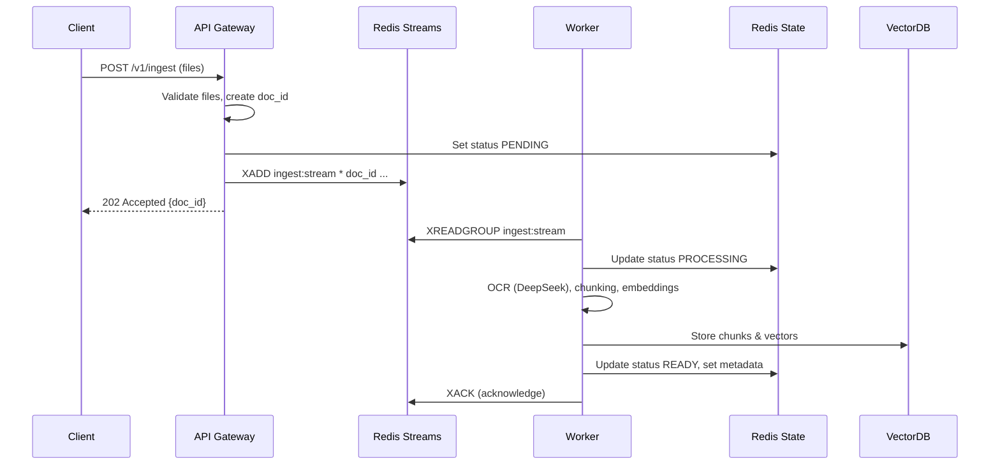
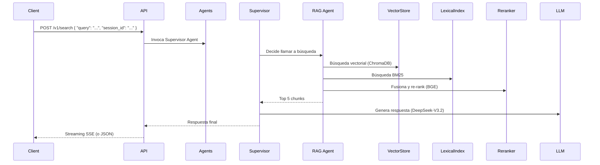

# Arquitectura Definitiva del Sistema Nexa Multimodal RAG (v3.0)

**Autor:** Ever Mamani Vicente  
**Fecha:** Abril 2026  
**Estado:** Aprobado para desarrollo  

> Este documento define los cimientos, principios, módulos, flujos, estrategias de resiliencia, escalabilidad y evolución del sistema Nexa. Todo está pensado para que el sistema sea **fácil de entender, modificar, escalar y eventualmente descomponer en microservicios** sin reescribir la lógica de negocio.


---

## Tabla de Contenidos

1.  [Principios Arquitectónicos Fundamentales](#1-principios-arquitectónicos-fundamentales)
2.  [Visión General y Objetivos Estratégicos](#2-visión-general-y-objetivos-estratégicos)
3.  [Arquitectura de Alto Nivel (Monolito Modular)](#3-arquitectura-de-alto-nivel-monolito-modular)
4.  [Estructura de Carpetas Detallada (Modular Monolith)](#4-estructura-de-carpetas-detallada-modular-monolith)
5.  [Componentes Internos y Sus Responsabilidades](#5-componentes-internos-y-sus-responsabilidades)
6.  [ADK 2.0: El Orquestador de Agentes (Rol y Estrategias)](#6-adk-20-el-orquestador-de-agentes-rol-y-estrategias)
7.  [Flujos Completos (Ingesta Asíncrona, Consulta, Agentes)](#7-flujos-completos-ingesta-asíncrona-consulta-agentes)
8.  [Configuración y Variables Globales (Modificables en Tiempo de Ejecución)](#8-configuración-y-variables-globales-modificables-en-tiempo-de-ejecución)
9.  [Escalabilidad Horizontal y Despliegue en Kubernetes](#9-escalabilidad-horizontal-y-despliegue-en-kubernetes)
10. [Estrategias de Resiliencia, Mitigación y Autocuración](#10-estrategias-de-resiliencia-mitigación-y-autocuración)
11. [Migración de Módulos a Microservicios (Evolución sin Dolor)](#11-migración-de-módulos-a-microservicios-evolución-sin-dolor)
12. [Monitoreo, Trazas y Documentación Viva](#12-monitoreo-trazas-y-documentación-viva)
13. [Plan de Implementación por Fases](#13-plan-de-implementación-por-fases)
14. [Glosario y Referencias](#14-glosario-y-referencias)

---

## 1. Principios Arquitectónicos Fundamentales

Estos son los pilares sobre los que se construye el sistema. Cualquier decisión técnica debe alinearse con ellos.

| Principio | Descripción |
|-----------|-------------|
| **Inversión de Dependencias (DIP)** | Los módulos de alto nivel no dependen de módulos de bajo nivel. Ambos dependen de abstracciones. |
| **Arquitectura Hexagonal (Puertos y Adaptadores)** | El núcleo de negocio ignora la infraestructura (APIs, bases de datos, colas). Todo se comunica a través de puertos (interfaces). |
| **CQRS (Command Query Responsibility Segregation)** | Separación total entre comandos (escritura/ingesta) y consultas (lectura/búsqueda). Cada uno tiene su propio modelo y, potencialmente, su propia base de datos. |
| **Event-Driven Architecture (EDA)** | Los cambios de estado (documento procesado, error, etc.) se comunican mediante eventos. Esto permite desacoplar módulos y facilita la evolución a microservicios. |
| **Monolito Modular (Modular Monolith)** | El sistema se despliega como una sola unidad (monolito) pero internamente está dividido en módulos con límites bien definidos y sin dependencias circulares. Cada módulo puede extraerse después como microservicio. |
| **Statelessness en la capa web** | Los nodos de la API no guardan estado local; el estado se delega a Redis/PostgreSQL. Así se puede escalar horizontalmente sin problemas. |
| **Resiliencia como requisito no funcional** | El sistema debe seguir funcionando (quizás en modo degradado) ante fallos de servicios externos, saturación o caídas de componentes. |
| **Configuración como código** | Toda variable de entorno o parámetro de configuración está definida en archivos (ej. `.env`, `settings.yaml`) y puede modificarse sin recompilar. |

---

## 2. Visión General y Objetivos Estratégicos

El sistema **Nexa** es una plataforma de **RAG multimodal asíncrono** que permite:

- Ingestar documentos (PDF, imágenes, Word) de forma **asíncrona** con devolución inmediata de un `document_id`.
- Consultar el estado de procesamiento de cada documento.
- Realizar **búsquedas semánticas e híbridas** (vectorial + BM25 + re-ranking) sobre los documentos procesados.
- Mantener **memoria de conversaciones** (sesiones) con capacidad de referenciar documentos previos.
- Orquestar **agentes de IA** (supervisores, planificadores, validadores) usando **Google ADK 2.0**.
- Permitir la **evolución a microservicios** extrayendo módulos completos (ej. el motor de OCR, el servicio de embeddings) sin cambiar el código del núcleo.

### 2.1 Métricas de éxito (no funcionales)

- **Latencia de ingesta síncrona**: < 100ms para devolver `document_id`.
- **Throughput de ingesta**: Al menos 100 documentos por minuto (con 10 workers).
- **Tiempo de procesamiento por página**: < 5 segundos (promedio).
- **Disponibilidad**: 99.9% para la API de consulta; 99% para el procesamiento asíncrono.
- **Escalabilidad**: De 1 a 20 réplicas sin cambios en el código.

---

## 3. Arquitectura de Alto Nivel (Monolito Modular)

El sistema se despliega como una sola aplicación (FastAPI + workers en segundo plano) pero internamente está dividido en **módulos independientes** que se comunican a través de **eventos** y **puertos**.

```mermaid
graph TB
    subgraph "Nexa Monolith (Kubernetes Pod)"
        API["API Gateway<br/>(FastAPI)"] 
        Workers["Workers Pool<br/>(Background processes)"]
        Agents["ADK 2.0 Agent Runtime<br/>(Supervisor + Sub-agents)"]
        Modules["Internal Modules<br/>(OCR, Embeddings, RAG, State)"]
    end

    API --> Modules
    Workers --> Modules
    Agents --> Modules
    
    Modules --> Ports["Puertos (interfaces)"]
    Ports --> Adapters["Adaptadores<br/>(DeepSeek, Chroma, Redis, etc.)"]
    
    style API fill:#1e293b,stroke:#94a3b8
    style Workers fill:#1e293b,stroke:#94a3b8
    style Agents fill:#1e293b,stroke:#94a3b8
    style Modules fill:#0f766e,stroke:#115e59
```



**Características clave:**
- **Un solo repositorio** con estructura modular.
- **Un solo despliegue** (imagen Docker) que contiene tanto la API como los workers y el runtime de agentes.
- **Escalado horizontal**: Kubernetes puede lanzar múltiples réplicas del pod; las colas y bases de datos externas son compartidas.
- **Separación de procesos**: Los workers se ejecutan en hilos/processes separados dentro del mismo contenedor (o en contenedores sidecar, según configuración).

---

## 4. Estructura de Carpetas Detallada (Modular Monolith)

Esta estructura refleja una **Clean Architecture** con módulos claramente delimitados, pensada para extracción futura.

```
nexa/
├── docker/
│   ├── Dockerfile
│   ├── docker-compose.yml (para desarrollo)
│   └── kubernetes/               # Manifiestos para despliegue en K8s
│       ├── deployment.yaml
│       ├── service.yaml
│       ├── hpa.yaml
│       └── configmap.yaml
│
├── docs/
│   ├── architecture.md           # Este documento
│   ├── adr/                      # Architecture Decision Records
│   └── diagrams/                 # Diagramas Mermaid (PNG exportado)
│
├── scripts/
│   ├── entrypoint.sh             # Script de arranque (API, workers, o ambos)
│   └── migrate_db.py             # Migraciones de base de datos
│
├── src/
│   ├── core/                     # Núcleo del negocio (sin infraestructura)
│   │   ├── domain/               # Entidades y value objects
│   │   │   ├── document.py
│   │   │   ├── chunk.py
│   │   │   ├── session.py
│   │   │   └── query.py
│   │   ├── ports/                # Interfaces (puertos) para infraestructura
│   │   │   ├── ocr_provider.py   # ABC IOCRProvider
│   │   │   ├── embedding_provider.py
│   │   │   ├── vector_store.py
│   │   │   ├── queue.py
│   │   │   └── state_repository.py
│   │   ├── use_cases/            # Casos de uso (lógica de aplicación)
│   │   │   ├── ingest_document.py
│   │   │   ├── search_query.py
│   │   │   ├── get_document_status.py
│   │   │   └── agent_orchestration.py
│   │   └── agents/               # Definición de agentes ADK 2.0
│   │       ├── supervisor_agent.py
│   │       ├── doc_processor_agent.py
│   │       ├── rag_agent.py
│   │       └── validator_agent.py
│   │
│   ├── infrastructure/           # Adaptadores concretos
│   │   ├── ocr/
│   │   │   ├── deepseek_adapter.py
│   │   │   └── docling_adapter.py
│   │   ├── embeddings/
│   │   │   └── gemini_adapter.py
│   │   ├── vector_stores/
│   │   │   ├── chromadb_adapter.py
│   │   │   └── bm25_adapter.py
│   │   ├── queue/
│   │   │   └── redis_streams_adapter.py
│   │   ├── cache/
│   │   │   └── redis_state_repo.py
│   │   └── llm/
│   │       └── lite_llm_client.py
│   │
│   ├── modules/                  # Módulos funcionales (empaquetan puertos + adaptadores)
│   │   ├── ingestion/            # Módulo de ingesta (comandos)
│   │   │   ├── __init__.py
│   │   │   ├── router.py         # Endpoints FastAPI específicos
│   │   │   ├── service.py        # Orquestación interna
│   │   │   └── schemas.py
│   │   ├── search/               # Módulo de búsqueda (consultas)
│   │   │   ├── __init__.py
│   │   │   ├── router.py
│   │   │   ├── service.py
│   │   │   └── schemas.py
│   │   ├── agents/               # Módulo de agentes (ADK runtime)
│   │   │   ├── __init__.py
│   │   │   ├── router.py         # Endpoints para invocar agentes
│   │   │   ├── runner.py
│   │   │   └── callbacks.py
│   │   └── admin/                # Módulo de administración (estado, métricas)
│   │       ├── __init__.py
│   │       ├── router.py
│   │       └── health.py
│   │
│   ├── shared/                   # Código compartido entre módulos
│   │   ├── config.py             # Configuración (pydantic-settings)
│   │   ├── logging.py
│   │   ├── exceptions.py
│   │   ├── middlewares.py        # Rate limiting, tracing, etc.
│   │   └── utils.py
│   │
│   └── main.py                   # Punto de entrada único (según variable de entorno)
│
├── tests/
│   ├── unit/
│   ├── integration/
│   └── e2e/
│
├── .env.example
├── pyproject.toml
├── README.md
└── Makefile
```

**Ventajas de esta estructura:**
- **Separación clara** entre `core` (reglas de negocio) e `infrastructure` (detalles).
- **Módulos** (`modules/`) representan cada capacidad del sistema y pueden extraerse fácilmente.
- **`main.py`** puede arrancar la API, los workers, o ambos según variable `NEXA_ROLE=api|worker|both|agent`.
- **Compartido** (`shared/`) evita duplicación sin crear dependencias circulares.

---

## 5. Componentes Internos y Sus Responsabilidades

| Componente | Ubicación | Responsabilidad | Se puede externalizar a microservicio |
|------------|-----------|----------------|----------------------------------------|
| **Ingestion Module** | `modules/ingestion` | Recibir documentos, validarlos, encolar tareas. | Sí (sería un servicio de ingesta independiente). |
| **OCR Adapter** | `infrastructure/ocr` | Llamar a DeepSeek-OCR 2 (Novita) o Docling local. | Sí (servicio de OCR dedicado). |
| **Embedding Adapter** | `infrastructure/embeddings` | Generar vectores con Gemini. | Sí. |
| **Vector Store Adapter** | `infrastructure/vector_stores` | Leer/escribir en ChromaDB y BM25. | Sí (cada uno podría ser un servicio). |
| **Queue Adapter** | `infrastructure/queue` | Publicar/consumir mensajes (Redis Streams). | Depende; si se usa Redis externo, no es microservicio aparte. |
| **Agent Runtime** | `modules/agents` | Ejecutar agentes ADK 2.0 (supervisor, etc.). | Sí (servicio de agentes). |
| **Search Module** | `modules/search` | Ejecutar búsquedas híbridas y re-ranking. | Sí. |
| **Admin Module** | `modules/admin` | Exponer métricas, health checks, estado de cola. | No (es parte de la API). |

**Nota:** Gracias a la inyección de dependencias, si un día movemos el OCR a un microservicio, solo creamos un nuevo adaptador que llame a ese servicio vía HTTP. El núcleo (`core/use_cases/ingest_document.py`) no cambia.

---

## 6. ADK 2.0: El Orquestador de Agentes (Rol y Estrategias)

**Google ADK 2.0** es el framework que utilizamos para implementar agentes de IA con capacidad de razonamiento, planificación y ejecución de herramientas. En Nexa, los agentes son parte del **módulo de agentes** y se invocan tanto desde la API síncrona (para consultas complejas) como desde workers (para tareas de enriquecimiento automático).

### 6.1 Agentes definidos

| Agente | Rol | Modelo recomendado | Herramientas (tools) |
|--------|-----|--------------------|----------------------|
| **Supervisor Agent** | Orquestador principal. Recibe la consulta del usuario, decide si delegar a otros agentes o responder directamente. | Gemini 3.1 Pro (por su razonamiento) | `delegate_to_rag`, `delegate_to_ingest`, `ask_user` |
| **RAG Agent** | Ejecuta la búsqueda híbrida (vectorial + BM25 + re-ranking) y devuelve los chunks relevantes. | DeepSeek-V3.2 (costo/eficiencia) | `search_vector_store`, `search_lexical`, `rerank` |
| **Document Processor Agent** | Se encarga de procesar documentos asíncronamente (OCR, chunking, embeddings). Se invoca mediante cola. | No usa LLM directamente, orquesta pipelines. | `ocr_extract`, `chunk_text`, `generate_embeddings` |
| **Validator Agent** | Revisa la respuesta generada por el RAG Agent para evitar alucinaciones. | Gemini 3.1 Flash-Lite | `check_faithfulness`, `check_grounding` |

### 6.2 Flujo de un agente supervisor (consulta compleja)

```python
# Dentro de modules/agents/runner.py
from google.adk.agents import LlmAgent, SequentialAgent, ParallelAgent
from google.adk.tools import FunctionTool

supervisor = LlmAgent(
    name="Supervisor",
    model="gemini-3.1-pro",
    instruction="Eres un orquestador. Decide si la consulta requiere búsqueda en documentos (RAG), procesar un nuevo documento, o es una pregunta general.",
    tools=[
        FunctionTool(delegate_to_rag_agent),
        FunctionTool(delegate_to_ingest_agent),
        FunctionTool(answer_general),
    ]
)
```

### 6.3 ADK 2.0 y escalabilidad

- El runtime de ADK es **stateless** (el estado se guarda en sesiones de Redis). Por tanto, podemos tener múltiples réplicas del agente ejecutándose en paralelo.
- Las herramientas (`tools`) pueden ser síncronas o asíncronas. ADK 2.0 ejecuta herramientas en paralelo automáticamente.
- Para tareas largas (como procesar un documento), la herramienta `delegate_to_ingest_agent` simplemente encola un comando y devuelve un `document_id`. El agente no espera.

---

## 7. Flujos Completos (Ingesta Asíncrona, Consulta, Agentes)

### 7.1 Ingesta asíncrona (con cola)



### 7.2 Consulta de estado

```
GET /v1/ingest/{doc_id}/status
Response: { "status": "READY", "progress": 1.0, "chunks_count": 120 }
```

### 7.3 Búsqueda RAG híbrida (síncrona, con timeout)



### 7.4 Conversación con memoria (sesiones)

- Cada interacción tiene un `session_id`. El estado de la sesión se guarda en Redis (con TTL configurable).
- El agente supervisor puede acceder al historial y a los documentos previamente procesados (usando el `document_id` que se guardó en la sesión).

---

## 8. Configuración y Variables Globales (Modificables en Tiempo de Ejecución)

Todas las variables se definen en un archivo `.env` o en un ConfigMap de Kubernetes. El sistema permite **recargar algunas configuraciones sin reiniciar** (usando un endpoint interno `/admin/reload`).

| Variable | Valor por defecto | Descripción | Modificable en caliente |
|----------|------------------|-------------|--------------------------|
| `MAX_DOCUMENTS_PER_INGEST` | 10 | Número máximo de documentos por petición. | Sí (vía API admin). |
| `MAX_PAGES_PER_DOCUMENT` | 1000 | Límite de páginas por documento. | Sí. |
| `OCR_PROVIDER` | `deepseek` | `deepseek` o `docling` (local). | No (requiere reinicio). |
| `EMBEDDING_MODEL` | `gemini-embedding-2` | Modelo de embeddings. | No. |
| `WORKER_CONCURRENCY` | 5 | Número de workers simultáneos por pod. | Sí (requiere restart de workers). |
| `QUEUE_MAXLEN` | 10000 | Longitud máxima de la cola. | Sí. |
| `CIRCUIT_BREAKER_THRESHOLD` | 5 | Fallos antes de abrir circuito. | Sí. |
| `CIRCUIT_BREAKER_TIMEOUT` | 30 | Segundos que permanece abierto. | Sí. |
| `REDIS_DSN` | `redis://localhost:6379` | Conexión a Redis. | No (reinicio). |
| `CHROMA_HOST` | `localhost` | Host de ChromaDB. | No. |
| `LOG_LEVEL` | `INFO` | Nivel de log. | Sí. |

**Estrategia de sobrecarga:** Si la cola supera el 80% de su capacidad (`QUEUE_MAXLEN`), el endpoint `/v1/ingest` devuelve `429 Too Many Requests` con un mensaje claro. El cliente debe reintentar con backoff.

---

## 9. Escalabilidad Horizontal y Despliegue en Kubernetes

El sistema está diseñado para correr en **Kubernetes** (o cualquier orquestador de contenedores). Se despliega un único **Deployment** con múltiples réplicas, pero cada réplica puede tener diferentes roles mediante la variable `NEXA_ROLE`.

### 9.1 Manifiesto básico (Deployment con multi-rol)

```yaml
apiVersion: apps/v1
kind: Deployment
metadata:
  name: nexa
spec:
  replicas: 5   # Escalado horizontal
  selector:
    matchLabels:
      app: nexa
  template:
    spec:
      containers:
      - name: nexa-api
        image: nexa:latest
        env:
        - name: NEXA_ROLE
          value: "api"      # Este contenedor solo sirve API
        ports:
        - containerPort: 8000
      - name: nexa-worker
        image: nexa:latest
        env:
        - name: NEXA_ROLE
          value: "worker"   # Este contenedor solo consume cola
      - name: nexa-agent
        image: nexa:latest
        env:
        - name: NEXA_ROLE
          value: "agent"    # Este contenedor ejecuta agentes
```

**Escalado automático (HPA)** basado en:
- Longitud de la cola (usando KEDA o prometheus-adapter).
- CPU/Memoria de los pods.

### 9.2 Estrategia de no guardar estado en los pods

- Las sesiones, colas y estado se guardan en **Redis externo** (operado aparte o en el mismo clúster).
- Los vectores en **ChromaDB** (o en su defecto PostgreSQL pgvector).
- Los archivos (imágenes, PDFs) en un **bucket S3** (MinIO, GCS, etc.).

Así, podemos matar un pod sin pérdida de datos.

---

## 10. Estrategias de Resiliencia, Mitigación y Autocuración

| Problema | Estrategia | Implementación |
|----------|------------|----------------|
| API de DeepSeek-OCR lenta o caída | Circuit breaker + fallback a Docling local (modo degradado). | `pybreaker` + `try/except` + timeout de 30s. |
| Cola llena (backpressure) | API devuelve 429; el cliente reintenta con backoff exponencial. | Verificar `llen(queue) > 0.8*maxlen`. |
| Worker muere mientras procesaba | La tarea no se confirma (ACK) hasta el final. Si el worker muere, la tarea reaparece en la cola y otro worker la toma. | Redis Streams `CLAIM` automático. |
| Falla en el enriquecimiento (Gemini) | Reintentar hasta 3 veces; si falla, se indexa sin enriquecimiento. | `tenacity` con backoff. |
| Base de datos vectorial caída | Respuesta de búsqueda devuelve solo resultados léxicos (BM25) y avisa al usuario. | Detección de health check de Chroma. |
| Timeout en búsqueda RAG | Si tarda más de 5s, se devuelve un timeout parcial con los resultados obtenidos hasta el momento. | `asyncio.timeout`. |
| Saturación general | El sistema entra en **modo de degradación** (deshabilita enriquecimiento, reduce re-ranking, etc.) automáticamente. | Monitor de carga (cola + CPU). |

### 10.1 Circuit Breaker (ejemplo con pybreaker)

```python
from pybreaker import CircuitBreaker

ocr_breaker = CircuitBreaker(fail_max=5, reset_timeout=30)

@ocr_breaker
def call_deepseek_ocr(image):
    return deepseek_api.ocr(image)
```

Si se abre el circuito, el adaptador lanza `CircuitBreakerError` y el caso de uso puede llamar al fallback.

---

## 11. Migración de Módulos a Microservicios (Evolución sin Dolor)

El sistema está preparado para que, llegado el momento, extraigamos módulos enteros a microservicios independientes sin cambiar el código del núcleo. Los pasos serían:

1. **Identificar el módulo** (ej. `ingestion`).
2. **Extraer el código** del módulo a un nuevo repositorio.
3. **Mantener los puertos** (interfaces) en el monolito. Crear un nuevo adaptador que llame al microservicio vía HTTP/gRPC.
4. **Desplegar el microservicio** en Kubernetes con su propio escalado.
5. **El monolito deja de tener el código interno** pero sigue funcionando porque usa el adaptador remoto.

Gracias a la inyección de dependencias, el cambio es transparente para el resto del sistema. No se toca ni un solo caso de uso.

**Ejemplo de adaptador para microservicio de OCR:**

```python
# infrastructure/ocr/remote_ocr_adapter.py
class RemoteOCRAdapter(IOCRProvider):
    async def extract(self, image_bytes):
        async with httpx.AsyncClient() as client:
            resp = await client.post("http://ocr-microservice/process", files={"image": image_bytes})
            return resp.json()["markdown"]
```

---

## 12. Monitoreo, Trazas y Documentación Viva

- **Métricas Prometheus**: Endpoint `/metrics` expone:
  - `nexa_documents_ingested_total`
  - `nexa_ingest_queue_length`
  - `nexa_ocr_latency_seconds`
  - `nexa_circuit_breaker_state`
  - `nexa_active_workers`
- **Trazas distribuidas**: OpenTelemetry + Jaeger (cada request lleva `X-Request-ID`).
- **Logs estructurados**: JSON con `request_id`, `doc_id`, `session_id`, `step`, `duration_ms`.
- **Documentación viva**:
  - Este documento en `docs/architecture.md` se mantiene actualizado con cada cambio arquitectónico.
  - Los ADR (Architecture Decision Records) se guardan en `docs/adr/`.
  - Diagramas Mermaid se renderizan automáticamente en GitHub.

---

## 13. Plan de Implementación por Fases

| Fase | Entregable | Duración estimada |
|------|------------|-------------------|
| 1 | Configurar Redis, cola, estado básico. Worker que hace OCR y guarda en vector store. | 2 semanas |
| 2 | API de ingesta asíncrona (POST /ingest, GET /status). | 1 semana |
| 3 | API de búsqueda híbrida (ChromaDB + BM25). | 2 semanas |
| 4 | Integración con ADK 2.0 (agente supervisor básico). | 2 semanas |
| 5 | Añadir circuit breaker, retries, health checks. | 1 semana |
| 6 | Despliegue en Kubernetes con HPA. | 1 semana |
| 7 | Documentación final y pruebas de carga. | 1 semana |

---

## 14. Glosario y Referencias

- **ADK 2.0**: Google Agent Development Kit versión 2 (framework de agentes).
- **CQRS**: Command Query Responsibility Segregation.
- **Circuit Breaker**: Patrón que evita llamadas repetidas a un servicio que falla.
- **Monolito Modular**: Un solo despliegue con módulos internos desacoplados.
- **Puerto (Port)**: Interfaz en el núcleo que define una capacidad.
- **Adaptador (Adapter)**: Implementación concreta de un puerto usando tecnología específica.
- **RRF**: Reciprocal Rank Fusion (técnica para combinar rankings de búsqueda).

---

## Conclusión Final

Este documento sienta las bases de un sistema **robusto, escalable y evolutivo**. Cada principio y cada componente han sido pensados para que el sistema pueda crecer desde un monolito pequeño hasta un ecosistema de microservicios sin reescrituras dolorosas.

**Próximos pasos sugeridos:**
1. Revisar la estructura de carpetas y adaptarla a tu gusto (aunque es muy completa, puedes renombrar `modules/` a `features/` si lo prefieres).
2. Crear el repositorio con esta estructura y el archivo `pyproject.toml`.
3. Implementar el primer worker (solo OCR + guardar en ChromaDB) como prueba de concepto.
4. Añadir el adaptador de cola con Redis Streams.

¿Te gustaría que ahora pase a escribir el código esqueleto de **uno de estos módulos** (por ejemplo, el adaptador de cola con Redis Streams y el worker) siguiendo esta arquitectura?