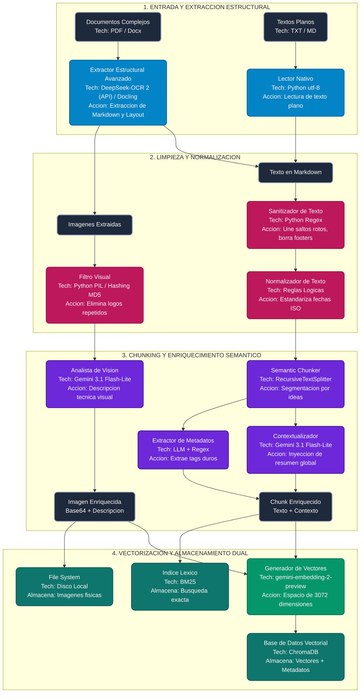
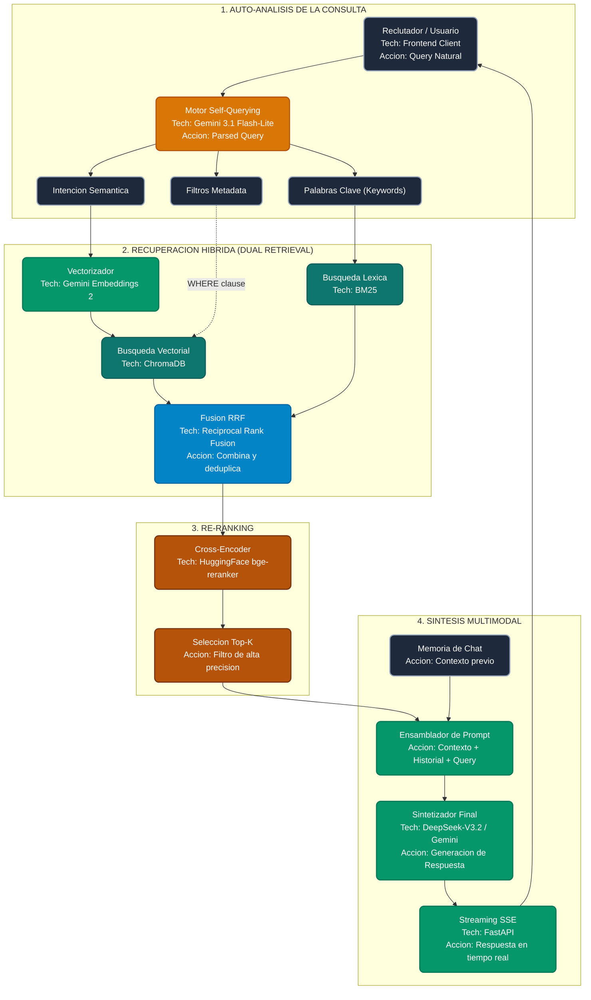

# Arquitectura del Sistema RAG Multimodal (Grado Industrial)

**Proyecto:** Nexa Multimodal RAG  
**Descripción:** Motor de Búsqueda Semántica y Generación Aumentada por Recuperación (RAG) diseñado para procesar y consultar documentos complejos de alta fidelidad.

<p align="left">
  
  
  
  
  
  
</p>

Este documento detalla los dos macro-flujos que componen el sistema: el **Flujo de Ingesta (Offline)** y el **Flujo de Consulta (Online)**, junto con un análisis técnico de la inyección de dependencias.

---

## 1. Macro-Bloque A: Pipeline de Ingesta y Entrenamiento (Offline)

Flujo asíncrono diseñado para evitar el principio GIGO (*Garbage In, Garbage Out*) mediante limpieza exhaustiva y enriquecimiento semántico antes de la vectorización en la base de datos.

### Diagrama del Flujo de Ingesta



---

## 2. Macro-Bloque B: Flujo de Consulta y Respuesta (Online)

Ejecución en tiempo real para resolver interacciones de usuario mediante Dual Retrieval y Re-Ranking.

### Diagrama del Flujo de Consulta



---

## 3. Análisis Arquitectónico: Reemplazo del Motor OCR

La transición de **Mistral OCR 3** a **DeepSeek-OCR 2** (o una librería local como **Docling**) pone a prueba la resiliencia del diseño Hexagonal. A continuación, se detalla el impacto técnico de este cambio en el sistema.

### 3.1. Impacto en el Dominio (Cero Acoplamiento)
El núcleo de la aplicación (`src/core/`) no sufre ninguna modificación. El contrato `IOCRProvider` y las entidades (`Document`, `TextChunk`, `ImageChunk`) permanecen inmutables. El sistema central no sabe, ni le importa, si el texto fue extraído por una API costosa o por un script local. 

### 3.2. Adaptación de la Capa de Infraestructura
El único cambio real ocurre en la capa de infraestructura. Se requiere la creación de un nuevo adaptador `src/infrastructure/ocr/deepseek_client.py` que implemente la interfaz `IOCRProvider`.
* **Traducción de Payloads:** DeepSeek-OCR 2 utiliza la arquitectura *DeepEncoder V2* (Qwen2-0.5B). El adaptador debe encargarse de mapear la respuesta JSON de la API de Novita (o el output de Docling) hacia nuestra entidad estandarizada de Markdown interno.
* **Manejo de Imágenes:** Si el nuevo proveedor OCR no devuelve las imágenes recortadas en Base64 (como lo hacía Mistral), el adaptador deberá incorporar lógica adicional (ej. PyMuPDF) para extraer las coordenadas dadas por el OCR y recortar las imágenes localmente antes de pasarlas al pipeline.

### 3.3. Impacto en Rendimiento y Costos
* **Latencia:** Al utilizar Novita API (Serverless), la latencia de red se mantiene. Si se opta por Docling (local), la latencia dependerá del hardware del servidor donde se despliegue FastAPI, eliminando el tiempo de espera por red pero aumentando el consumo de CPU/RAM.
* **Eficiencia Financiera:** El cambio a DeepSeek-OCR 2 reduce el costo drásticamente de $2.00 USD por 1000 páginas a aproximadamente $0.06 USD por millón de tokens, optimizando el presupuesto del pipeline offline.

### 3.4. Inyección de Dependencias (El Switch)
Gracias a `Dependency Injection`, el cambio en el código de producción se reduce a modificar una sola línea en el enrutador principal (`routes.py` o `container.py`):

```python
# ANTES:
# ocr_service = MistralOCRClient(api_key=settings.MISTRAL_API_KEY)

# DESPUÉS:
ocr_service = DeepSeekOCRClient(api_key=settings.NOVITA_API_KEY)

# El orquestador recibe la nueva dependencia sin necesidad de reescribir la lógica de negocio
use_case = IngestDocumentUseCase(ocr_provider=ocr_service, ...)
```

---

**Autor y Arquitecto de Software:** Ever Mamani Vicente  
**Contacto Profesional:** evermamanivicente@gmail.com  
**Versión del Documento:** v1.2.0 | Abril 2026  
```
